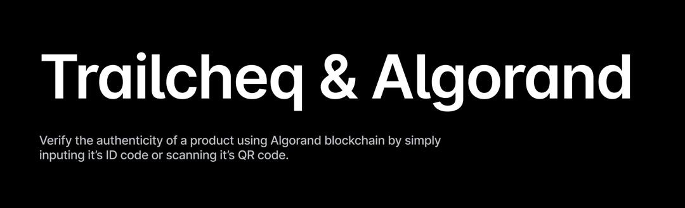
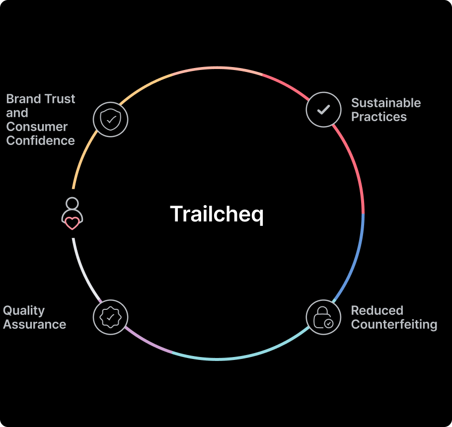

<h1 align="center">
    <br>
    <a href="https://github.com/davonjagah/traillcheq">
        
    </a>
    <br>
</h1>

<h3 align="center">Verify the authenticity of a product using Algorand blockchain by simply inputing it’s ID code or scanning it’s QR code.</h3>

<p align="center">
    
        
    
    
</p>

<p align="center">
    <a href="#-about">About</a> •
    <a href="#-features">Features</a> •
    <a href="#-folder-structure">Folder Structure</a> •
    <a href="#-api-documentation">Installation</a> •
    <a href="#-contributing">Contributing</a> •
    <a href="#-team">Team</a>
</p>

## 📝 About.

TrailCheq is a decentralized application built on the algorand blockchain that enables users to verify the authenticity of products by inputting their unique ID codes or scanning their QR codes. The platform leverages blockchain technology to create a tamper-proof record of product information, ensuring transparency and traceability throughout the supply chain.


## 🎯 Features.

Through Trailcheq’s frontend dashboard, companies can seamlessly manage their product portfolios. They can connect their Algorand wallet, create and edit products, and update descriptions to reflect lifecycle events. Consumers and businesses alike can use the “Cheq Screen” to input a product ID or scan a QR code, instantly verifying a product’s history and timeline, allowing them to make informed purchasing decisions.

Product Lifecycle Management:
Each product created by a registered company is assigned its own Algorand account, storing key information such as the product's name, category, description, lifecycle log, creation timestamp, and producer details. As products move through the supply chain, companies can log updates to the product description, allowing for the tracking of significant events like sourcing changes or processing milestones.

If one company supplies a product to another, such as a farm providing meat to a burger manufacturer, the original product’s ID is referenced in the new product’s description. This cross-referencing creates a secure “chain of custody,” enabling both companies and consumers to trace a product’s journey through each stage of its lifecycle.


<h1 align="center">
    <br>
    <a href="https://github.com/davonjagah/trailcheq">
        
    </a>
    <br>
</h1>

## 🗂️ Folder Structure.

```sh
trailcheq/
├── smart-contracts/
├                   ├── contracts/
├                        ├── trailCheq.algo.ts  (contains smart contracts code)
├── frontend/
     ├── contains frontend (contains small test cases for smart contracts)

```

## 📚 Documentation.

<sup>[(Back to top)](#------------------------)</sup>

1. Clone this repository to your local machine.
2. Ensure [Docker](https://www.docker.com/) is installed and operational. Then, install `AlgoKit` following this [guide](https://github.com/algorandfoundation/algokit-cli#install).
3. Run `algokit project bootstrap all` in the project directory. This command sets up your environment by installing necessary dependencies, setting up a Python virtual environment, and preparing your `.env` file.
4. In the case of a smart contract project, execute `algokit generate env-file -a target_network localnet` from the `trailcheq-contracts` directory to create a `.env.localnet` file with default configuration for `localnet`.
5. To build your project, execute `algokit project run build`. This compiles your project and prepares it for running.
6. For project-specific instructions, refer to the READMEs of the child projects:
   - Smart Contracts: [trailcheq-contracts](projects/trailcheq-contracts/README.md)
   - Frontend Application: [trailcheq-frontend](projects/trailcheq-frontend/README.md)

> This project is structured as a monorepo, refer to the [documentation](https://github.com/algorandfoundation/algokit-cli/blob/main/docs/features/project/run.md) to learn more about custom command orchestration via `algokit project run`.


Requirements

- Algokit
- React Jsx
- Tealscript
- Node.js
- NPM
- Docker 

## 🚀 Installation.

clone the repository using the following command:

```sh
$  git clone git@github.com:davonjagah/trailcheq.git
```
 
Navigate to the project directory:

```sh
$ cd trailcheq
```

To install the project dependencies, run the following command:

```sh
$ algokit project bootstrap all
```

To build the project, run the following command:

```sh
$ algokit project run build
```

To start the project, run the following command:

```sh
$ npm run start
```

## 👍 Contributing.

We believe in the power of collaboration and welcome contributions from all members of the community irrespective of your domain knowledge and level of expertise, your input is valuable. Here are a few ways you can get involved:

- Report bugs and issues
- Suggest new features and enhancements
- Contribute to the codebase by submitting pull requests
- Share the project with your network
- Provide feedback and suggestions for improvement

## 👥 Team.

- Samuel Tosin
- David Kazeem

## 👨🏽‍🍳 Developer Resources.

- [Algokit](https://developer.algorand.org/docs/get-started/algokit/?__hstc=10350826.4f04cac7c96df4e2313e74a6c7e85669.1727669739788.1729608270578.1730778906712.5&__hssc=10350826.1.1730778906712&__hsfp=51185828)
- [Tealscrip tutorial](https://www.youtube.com/playlist?list=PLwRyHoehE434hyDE6SvSrN-GUqAB07fju)

## 📜 License.

This project is licensed under the MIT License - see the [LICENSE](LICENSE) file for details.
